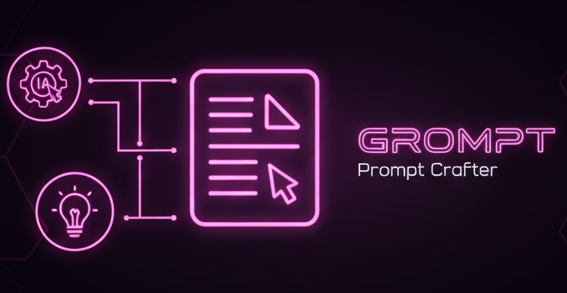

# 

[](https://github.com/kubex-ecosystem/grompt/releases/latest)
[](https://github.com/kubex-ecosystem/grompt/actions/workflows/kubex_go_release.yml)
[](https://golang.org)
[](https://reactjs.org)
[](https://nextjs.org)
[](docs/CONTRIBUTING.md)
[](LICENSE)

---

**Grompt** is a modern prompt engineering tool that applies real engineering practices to transform messy, unstructured thoughts into clean, effective prompts for AI models. Built with Go and React, it runs as a single binary with zero dependencies.

---

## **Table of Contents**

1. [🎯 Why Grompt?](#-why-grompt)
2. [✨ Key Features](#-key-features)
3. [🚀 Quick Start](#-quick-start)
4. [🖥️ CLI Commands](#️-cli-commands)
5. [💡 Usage Examples](#-usage-examples)
6. [🎪 Use Cases](#-use-cases)
7. [⚙️ Configuration & API Support](#️-configuration--api-support)
8. [🔗 Custom Build Hooks](#-custom-build-hooks-modular-build-steps-with-pred-and-posd)
9. [🛡️ Security & Best Practices](#️-security--best-practices)
10. [🏗️ Performance & Specifications](#-performance--specifications)
11. [🛣️ Roadmap](#️-roadmap)
12. [🤝 Contributing](#-contributing)
13. [🙏 Acknowledgments](#-acknowledgments)
14. [📄 License](#-license)
15. [🌎 Documentation](#-documentation)

---

## 🎯 **Why Grompt?**

**Before Grompt:**

```plaintext
hey can you help me make a function that takes a list and sorts it but also
removes duplicates and maybe returns the count too? oh and it should work
with strings and numbers...
```

**After Grompt:**

```plaintext
Create a generic TypeScript function that:

**Primary Objective:** Process arrays with dual functionality - sorting and deduplication

**Requirements:**
- Accept arrays of primitive types (strings, numbers)
- Remove duplicate values while preserving original data types
- Sort results using appropriate comparison logic
- Return both processed array and count metadata

**Expected Output:**
- Function signature with proper generic constraints
- Return type: { sorted: T[], count: number }
- Handle edge cases (empty arrays, single elements)
- Include JSDoc documentation with examples

**Context:** Building a data processing utility for a React application where consistent array manipulation is needed across multiple components.
```

---

## ✨ **Key Features**

| Feature | Description |
|---------|-------------|
| 🧠 **Real Prompt Engineering** | Applies genuine prompt engineering techniques, not just templates |
| ⚛️ **Modern React UI** | Responsive, intuitive interface with dark/light themes |
| 🐹 **Robust Go Backend** | Efficient HTTP server with zero external dependencies |
| 📦 **Single Binary** | Self-contained executable - just download and run |
| 🌍 **Cross-Platform** | Windows, Linux, macOS support out of the box |
| 🔌 **Multiple AI Providers** | OpenAI, Claude, DeepSeek, Ollama, plus demo mode |
| 🚀 **Instant Setup** | No installation, configuration, or cloud dependencies required |

---

## 🚀 **Quick Start**

### Option 1: Download Links

Grab the latest release for your platform:

- [Linux amd64](https://github.com/kubex-ecosystem/grompt/releases/latest/download/grompt_linux_amd64)
- [macOS Intel](https://github.com/kubex-ecosystem/grompt/releases/latest/download/grompt_darwin_amd64)
- [macOS Apple Silicon](https://github.com/kubex-ecosystem/grompt/releases/latest/download/grompt_darwin_arm64)
- [Windows](https://github.com/kubex-ecosystem/grompt/releases/latest/download/grompt_windows_amd64.exe)

Or see all options in the [Releases Page](https://github.com/kubex-ecosystem/grompt/releases).

### Option 2: Download and Run (Terminal)

```bash
# Download the latest release for your platform
curl -L https://github.com/kubex-ecosystem/grompt/releases/latest/download/grompt-linux-amd64 -o grompt
chmod +x grompt
./grompt

# Opens automatically at http://localhost:8080
```

### Option 3: Build from Source

```bash
git clone https://github.com/kubex-ecosystem/grompt
cd grompt
make build
./dist/grompt -h
```

Or you can install directly from make command:

```bash
git clone https://github.com/kubex-ecosystem/grompt
cd grompt
make install
grompt -h
```

**That's it!** No Docker, no complex setup, no cloud accounts needed.

### CLI: Generate AI Squad

Use the `squad` command to generate an `AGENTS.md` with recommended AI agents based on your project requirements:

```bash
./grompt squad "Want a backend microservice for payments, with authentication, Stripe integration, automated tests, and Docker deployment. Prefer Go or Python, no Java."
```

This will create an `AGENTS.md` file in the current directory.

---

## 🖥️ **CLI Commands**

Grompt provides a command-line interface (CLI) for interacting with AI models and managing prompts. Here are the main commands you can use:

1. **ask**: Send a direct prompt to an AI provider.

   ```bash
   ./grompt ask "What is the capital of France?" --provider openai --apikey 'sk-...' --model 'gpt-4'
   ```

   ```bash
   GEMINI_API_KEY='sk-...' \
   grompt ask 'How to implement user authentication?' \
      --provider 'gemini' \
      --model 'gemini-1.5-pro' \
      --max-tokens 1000
   ```

2. **generate**: Create prompts from ideas using prompt engineering.

   ```bash
   export GEMINI_API_KEY='sk-...' &&
   grompt generate --model 'gemini-2.0-flash' \
    --idea 'Was thinking about a feature that summarizes scientific articles.' \
    --idea 'Also want it to highlight key points and references.' \
    --idea 'Make it user-friendly and easy to integrate with other tools.' \
    --max-tokens 10000 --purpose 'code' --provider gemini
   ```

   **Response**:

   ```bash
     [INFO]  ℹ️  - 🔨 Engineering prompt from 3 ideas using GEMINI
     # Generated Prompt (gemini - gemini-2.0-flash)

     ```markdown
     ## Prompt: Scientific Article Summarization and Key Point Extraction

     **Persona:** You are a highly skilled software engineer specializing in natural language processing and API development. Your task is to design a function that efficiently summarizes scientific articles and extracts key information for users.

     **Objective:** Develop a Python function that takes the text of a scientific article as input and returns a structured summary, highlighting key points and providing a list of cited references.

     **Instructions:**

     1.  **Input:** The function will receive the full text of a scientific article as a string. This text may contain formatting inconsistencies (e.g., inconsistent whitespace, special characters).

     2.  **Preprocessing:** Clean the input text by:
         *   Removing extraneous whitespace (leading/trailing spaces, multiple spaces).
         *   Handling special characters appropriately (e.g., converting LaTeX symbols if possible, or removing them if conversion is not feasible).

     3.  **Summarization:** Generate a concise summary of the article (approximately 3-5 sentences). Focus on the article s main findings and conclusions. Use extractive or abstractive summarization techniques as appropriate. Prioritize clarity and conciseness.

     4.  **Key Point Extraction:** Identify and extract 3-5 key points from the article. These should be the most significant findings, arguments, or contributions made by the authors. Present these as a bulleted list. Each point should be a single, clear sentence.

     5.  **Reference Extraction:** Identify and extract all cited references from the article. The output should be a list of strings, where each string represents a single reference. Attempt to format each reference in a consistent style (e.g., APA, MLA, or a simplified numeric style). If a specific style is not feasible, prioritize accuracy and completeness.

     6.  **Output Format:** The function should return a dictionary with the following keys:
         *   `summary`: A string containing the summary of the article.
         *   `key_points`: A list of strings, where each string is a key point.
         *   `references`: A list of strings, where each string is a reference.

     **Example:**

     ```python
     def summarize_article(article_text: str) -> dict:
       """
       Summarizes a scientific article, extracts key points, and identifies references.

       Args:
         article_text: The full text of the scientific article.

       Returns:
         A dictionary containing the summary, key points, and references.
       """
       # Your code here (including preprocessing, summarization, key point extraction, and reference extraction)
       # Example output (replace with actual results):
       summary = "This study investigates the effects of X on Y, finding a significant correlation. The results suggest Z as a potential mechanism."
       key_points = [
           "X has a significant impact on Y.",
           "Z is proposed as a potential mediator of the X-Y relationship.",
           "Further research is needed to confirm the causal link."
       ]
       references = [
           "Smith, J. (2020). The Impact of X on Y. Journal of Science, 1(1), 1-10.",
           "Doe, A. (2021). Z as a Mediator. Nature, 2(2), 11-20."
       ]
       return {"summary": summary, "key_points": key_points, "references": references}

     # Example Usage:
     article_text = " [Insert example scientific article text here] "
     result = summarize_article(article_text)
     print(result)
     \```

     **Constraints:**

     * Prioritize accuracy and clarity in the summary and key points.
     * The function should be reasonably efficient in terms of processing time.
     * The code should be well-documented and easy to understand.
     * Consider using relevant Python libraries such as `nltk`, `transformers`, or `spaCy` for text processing and summarization.

     **Testing:**

     * Test the function with a variety of scientific articles from different domains.
     * Verify that the summary accurately reflects the content of the article.
     * Ensure that the key points are relevant and informative.
     * Confirm that the references are correctly extracted and formatted.

    ```

3. **squad**: Generate a list of recommended AI agents based on your project requirements.

   ```bash
   ./grompt squad "I need a backend microservice for payments, with authentication, Stripe integration, automated tests, and Docker deployment. Prefer Go or Python, no Java."
   ```

   This will create an `AGENTS.md` file in the current directory with the recommended agents.

   **AGENTS.md Content:**

   ```bash
     [INFO]  ℹ️  - 🧠 Generating AI Squad from project description using OPENAI
     [INFO]  ℹ️  - 📝 Writing AGENTS.md file with recommended agents

     ```markdown
     # AGENTS.md

     ## Recommended AI Agents for Your Project

     Based on your project requirements, here are the recommended AI agents to help you build a robust backend microservice for payments:

     ### 1. Backend Developer Bot
     - **Role:** Develop the core backend functionality using Go or Python.
     - **Skills:** REST API design, database integration, authentication mechanisms.
     - **Responsibilities:** Implement payment processing logic, handle API requests, and ensure secure data handling.

     ### 2. Authentication Specialist Bot
     - **Role:** Design and implement user authentication and authorization.
     - **Skills:** OAuth2, JWT, session management, security best practices.
     - **Responsibilities:** Create secure login/logout endpoints, manage user sessions, and protect sensitive routes.

     ### 3. Payment Gateway Integrator Bot
     - **Role:** Integrate Stripe payment gateway into the microservice.
     - **Skills:** Stripe API, webhooks, payment processing workflows.
     - **Responsibilities:** Set up Stripe integration, handle payment events, and manage transaction records.

     ### 4. Testing & QA Bot
     - **Role:** Develop automated tests to ensure code quality and reliability.
     - **Skills:** Unit testing, integration testing, test frameworks (e.g., pytest for Python, testing package for Go).
     - **Responsibilities:** Write test cases for all functionalities, ensure high test coverage, and automate test execution.

     ### 5. DevOps & Deployment Bot
     - **Role:** Manage Docker deployment and CI/CD pipelines.
     - **Skills:** Docker, container orchestration (e.g., Kubernetes), CI/CD tools (e.g., GitHub Actions).
     - **Responsibilities:** Create Dockerfiles, set up deployment pipelines, and monitor application performance.

     ## Summary

     By leveraging these AI agents, you can efficiently build a secure and scalable backend microservice for payments that meets your specified requirements. Each agent focuses on a specific aspect of the project to ensure comprehensive coverage of all necessary functionalities.

   ```

---

## 💡 **Usage Examples**

### Example 1: Code Generation Prompt

**Input Ideas:**

- "Make a REST API"
- "User authentication"
- "Database with PostgreSQL"
- "Rate limiting"

**Generated Prompt:**

```plaintext
Create a RESTful API server with the following specifications:

**Core Requirements:**
- User authentication system with JWT tokens
- PostgreSQL database integration with proper schema design
- Rate limiting middleware to prevent abuse
- RESTful endpoints following standard conventions

**Technical Stack:**
- Backend framework of your choice (Node.js/Express, Go, Python/FastAPI)
- PostgreSQL for data persistence
- JWT for stateless authentication
- Redis or in-memory rate limiting

**Deliverables:**
- Complete API server with documented endpoints
- Database migration scripts
- Authentication middleware implementation
- Rate limiting configuration
- Basic API documentation

**Security Considerations:**
- Password hashing (bcrypt or similar)
- Input validation and sanitization
- CORS configuration
- Environment variable management for secrets
```

### Example 2: Creative Writing Prompt

**Input Ideas:**

- "Sci-fi story"
- "Time travel paradox"
- "Character loses memory"
- "Mystery elements"

**Generated Prompt:**

```plaintext
Write a science fiction short story with the following elements:

**Core Concept:** Time travel creates a paradox that affects the protagonist's memory

**Plot Structure:**
- Protagonist discovers they can time travel but each trip erases specific memories
- A mystery unfolds as they realize someone else knows about their ability
- The memory loss isn't random - it's following a pattern that reveals a larger conspiracy
- Resolution must address both the time paradox and the mystery elements

**Setting & Tone:**
- Near-future setting with accessible time travel technology
- Psychological thriller atmosphere with sci-fi elements
- Focus on internal conflict and mystery rather than action

**Character Development:**
- Protagonist struggles with unreliable memories and identity
- Supporting characters may know more than they initially reveal
- Character growth through solving the mystery despite memory limitations

**Target Length:** 2,000-3,000 words
**Style:** Third-person limited perspective focusing on the protagonist's confusion and discovery process
```

---

## 🎪 **Use Cases**

| Scenario | How Grompt Helps |
|----------|------------------|
| **Code Reviews** | Transform vague feedback into specific, actionable prompts for improvements |
| **Content Creation** | Convert content briefs into detailed creative writing or copywriting prompts |
| **Learning & Research** | Turn study topics into structured learning prompts with clear objectives |
| **API Documentation** | Convert technical notes into comprehensive documentation requests |
| **Design Systems** | Transform design ideas into detailed component specification prompts |
| **Data Analysis** | Convert business questions into precise data science and analysis prompts |

---

## ⚙️ **Configuration & API Support**

### Environment Variables

```bash
# Server Configuration
export PORT=8080                    # Server port (default: 8080)
export DEBUG=true                   # Enable debug mode

# AI Provider APIs (all optional)
export OPENAI_API_KEY=sk-...        # OpenAI GPT models
export CLAUDE_API_KEY=sk-ant-...    # Anthropic Claude models
export DEEPSEEK_API_KEY=...         # DeepSeek models
export CHATGPT_API_KEY=...          # ChatGPT API

# Local AI
export OLLAMA_ENDPOINT=http://localhost:11434  # Ollama local models
```

### Supported AI Providers

| Provider | Models | Setup Required |
|----------|--------|----------------|
| **Demo Mode** | Built-in templates | ✅ None - works out of the box |
| **OpenAI** | GPT-4, GPT-4o, GPT-3.5-turbo | API key |
| **Claude** | Claude 3.5 Sonnet, Claude 3 Haiku | API key |
| **DeepSeek** | DeepSeek Chat, DeepSeek Coder | API key |
| **Ollama** | Llama, Mistral, CodeLlama, etc. | Local installation |

---

### Development Setup

```bash
# Clone the repository
git clone https://github.com/yourusername/grompt.git
cd grompt

# Development mode
make build-dev

# Build for production
make build

# Cross-platform builds
make build windows amd64

# Clean up
make clean
```

### API Endpoints

```bash
# Configuration & Health
GET  /api/config     # Available APIs and configuration
GET  /api/health     # Server health status
GET  /api/models     # Available models per provider

# Prompt Generation
POST /api/unified    # Unified endpoint for all providers
POST /api/openai     # OpenAI specific endpoint
POST /api/gemini     # Gemini specific endpoint
POST /api/chatgpt    # ChatGPT specific endpoint
POST /api/claude     # Claude specific endpoint
POST /api/deepseek   # DeepSeek specific endpoint
POST /api/ollama     # Ollama specific endpoint

# Utility
GET  /api/test       # Test API provider availability
```

---

## 🔗 **Custom Build Hooks: Modular Build Steps with `pre.d` and `pos.d`**

Grompt supports **user-customizable build hooks** that run before and after the main build process.
This provides maximum flexibility for teams and advanced users who need to automate steps, integrate with other tools, or adapt builds for different environments — **all without changing core scripts.**

### 📂 **How It Works**

- **Scripts in `support/pre.d/`** are executed **before** the main build (pre-build).
- **Scripts in `support/pos.d/`** run **after** the main build (post-build).
- All scripts are executed in **lexicographic order** (`01-init.sh`, `10-db-migrate.sh`, etc).
- Each script runs in its own subshell for safety.

**Perfect for:**

- Setting up environment variables before building
- Running migrations or checks
- Cleaning up files or sending notifications after build

### 📝 **Example Hook Script**

- **support/pre.d/10-setup-env.sh**

```bash
#!/usr/bin/env bash
# Example pre-build hook

echo "🔧 [pre.d] Setting up environment..."
export GROMPT_ENV="dev"
```

- **support/pos.d/10-notify.sh**

```bash
#!/usr/bin/env bash
# Example post-build hook

echo "✅ [pos.d] Build completed! Sending notification..."
# your notification code here
```

---

## ⚠️ **Security & Best Practices**

- **Scripts are run with the current user’s permissions.**
  **DO NOT** add untrusted code to these folders!
- Keep hooks small, modular, and easy to review.
- Always set execute permission: `chmod +x script.sh`
- Use ordered prefixes (`01-`, `02-`, etc) for predictable execution.
- If a script fails, the error is logged but the process continues (you can tune this as needed).
- Full execution log is available for troubleshooting.

### 🛡️ **Sandboxing Tips (Bash Shell Level)**

While bash has limited sandboxing, these measures help mitigate risk:

- **Run each script in a subshell:**
  Prevents variable/function leakage.

  ```bash
  ( bash "$SCRIPT" )
  ```

- **Restrict permissions:**
  Set `chmod 500` on scripts, and limit writable locations.
- **Resource limits:**
  Use `ulimit` for memory/CPU protection (Linux).

  ```bash
  ulimit -v 1048576  # Limit to 1GB RAM
  ```

- **Use containers or chroot for critical tasks** (advanced).
- **Review every script before use**; never add code you don't trust.

### 📄 **Template: Default Hook Script**

- **support/pre.d/10-example.sh**

```bash
#!/usr/bin/env bash
# Pre-build hook example for Grompt/GoForge template

echo "🔧 Running $(basename "$0")"
# Put your custom commands below
```

- **support/pos.d/10-example.sh**

```bash
#!/usr/bin/env bash
# Post-build hook example for Grompt/GoForge template

echo "✅ Finished $(basename "$0")"
# Put your custom cleanup, notification, or deployment steps here
```

### 💡 **Why Use This System?**

- **No need to fork or patch main build scripts for local/company tweaks**
- Keeps project clean, modular, and easy to maintain
- Encourages community contributions and custom workflows
- Great for CI/CD, advanced automation, or onboarding new team members

---

## 🏆 **Summary**

> Create or drop scripts into `support/pre.d/` and `support/pos.d/`, make them executable, and Grompt (or any GoForge-based project) will run them for you at the right time.
> This makes your automation as extensible as your imagination — no more “hacking” core scripts.

## 🛣️ **Roadmap**

### 🚧 Current Development

- [ ] **Prompt Templates Library** - Pre-built templates for common use cases
- [ ] **Batch Processing** - Process multiple ideas simultaneously

### ⚡️ Future Features

- [ ] **Team Collaboration** - Share prompts and collaborate on prompt engineering
- [ ] **API Rate Limiting** - Built-in rate limiting for API providers
- [ ] **Integration Webhooks** - Connect with external tools and workflows
- [ ] **Prompt Testing Framework** - A/B test different prompt variations

---

## 🤝 **Contributing**

We welcome contributions! Here's how you can help:

### 🐛 **Bug Reports & Feature Requests**

- Open an issue with detailed description
- Include steps to reproduce for bugs
- Use issue templates when available

### 📋 **Development Guidelines**

- Follow Go and React best practices
- Add tests for new functionality
- Update documentation for API changes
- Ensure cross-platform compatibility

### 🎯 **Good First Issues**

Look for issues labeled `good-first-issue` or `help-wanted` to get started!

---

## � **Performance & Specifications**

| Metric | Value |
|--------|-------|
| **Binary Size** | ~15MB (includes React frontend) |
| **Memory Usage** | ~20MB idle, ~50MB under load |
| **Startup Time** | <1 second |
| **Response Time** | <100ms (excluding AI API calls) |
| **Concurrent Users** | 1000+ (depends on AI provider limits) |
| **Platform Support** | Windows, Linux, macOS (x86_64, ARM64) |

---

## 🙏 **Acknowledgments**

Special thanks to:

- **[Anthropic](https://anthropic.com)** for the Claude API and advancing AI safety
- **[OpenAI](https://openai.com)** for pioneering accessible AI models
- **[Ollama](https://ollama.ai)** for making local LLMs accessible to everyone
- **[Gemini](https://ai.google/gemini)** for their cutting-edge AI models
- **[DeepSeek](https://deepseek.ai)** for their innovative AI solutions
- **[Go Team](https://golang.org)** for creating a robust, efficient language
- **[React Team](https://reactjs.org)** for the excellent UI framework
- **All contributors** who help improve this project
- **[Spotify](https://www.spotify.com)** for their music streaming service who keep me company while coding!

---

## 📄 **License**

This project is licensed under the MIT License - see the [LICENSE](LICENSE) file for details.

## 🌎 **Documentation**

- **[English Documentation](README.md)** (this file)
- **[Documentação em Português](docs/README.pt-BR.md)**
- **[Contributing Guidelines](docs/CONTRIBUTING.md)**

---

***Open source lives and grows in the open — by the people, for the people. ❤️***

[⭐ Star this project](https://github.com/kubex-ecosystem/grompt/stargazers)\
[🐛 Report Bug](https://github.com/kubex-ecosystem/grompt/issues)\
[✨ Request Feature](https://github.com/kubex-ecosystem/grompt/issues)

*Transform your ideas into powerful prompts today!*
