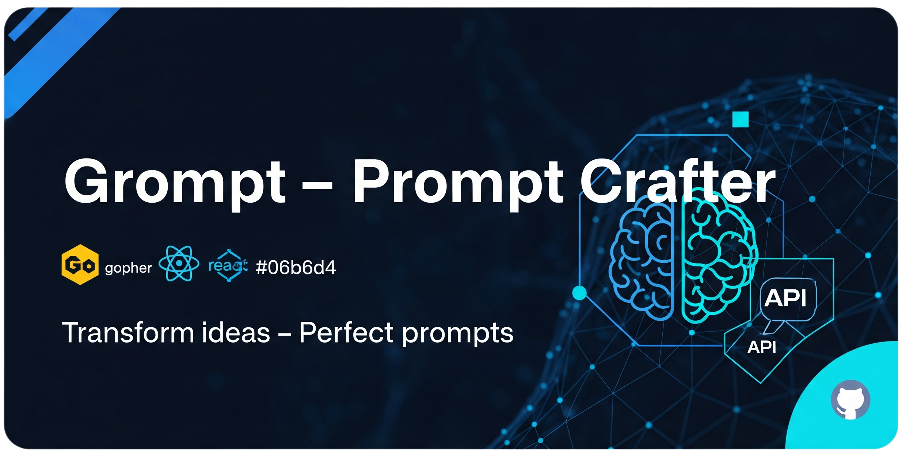

# 

> **Transform your raw ideas into structured, professional prompts with real engineering practices**

[](https://golang.org)
[](https://reactjs.org)
[](LICENSE)
[](docs/CONTRIBUTING.md)
[](https://github.com/rafa-mori/grompt/stargazers)

**Grompt** is a modern prompt engineering tool that applies real engineering practices to transform messy, unstructured thoughts into clean, effective prompts for AI models. Built with Go and React, it runs as a single binary with zero dependencies.

---

## **Table of Contents**

1. [🎯 Why Grompt?](#-why-grompt)
2. [✨ Key Features](#-key-features)
3. [🚀 Quick Start](#-quick-start)
4. [💡 Usage Examples](#-usage-examples)
5. [🎪 Use Cases](#-use-cases)
6. [⚙️ Configuration & API Support](#️-configuration--api-support)
7. [🔗 Custom Build Hooks](#-custom-build-hooks-modular-build-steps-with-pred-and-posd)
8. [🛡️ Security & Best Practices](#️-security--best-practices)
9. [🏗️ Performance & Specifications](#-performance--specifications)
10. [🛣️ Roadmap](#️-roadmap)
11. [🤝 Contributing](#-contributing)
12. [🙏 Acknowledgments](#-acknowledgments)
13. [📄 License](#-license)
14. [🌎 Documentation](#-documentation)

---

## 🎯 **Why Grompt?**

**Before Grompt:**

```plaintext
hey can you help me make a function that takes a list and sorts it but also 
removes duplicates and maybe returns the count too? oh and it should work 
with strings and numbers...
```

**After Grompt:**

```plaintext
Create a generic TypeScript function that:

**Primary Objective:** Process arrays with dual functionality - sorting and deduplication

**Requirements:**
- Accept arrays of primitive types (strings, numbers)
- Remove duplicate values while preserving original data types
- Sort results using appropriate comparison logic
- Return both processed array and count metadata

**Expected Output:**
- Function signature with proper generic constraints
- Return type: { sorted: T[], count: number }
- Handle edge cases (empty arrays, single elements)
- Include JSDoc documentation with examples

**Context:** Building a data processing utility for a React application where consistent array manipulation is needed across multiple components.
```

---

## ✨ **Key Features**

| Feature | Description |
|---------|-------------|
| 🧠 **Real Prompt Engineering** | Applies genuine prompt engineering techniques, not just templates |
| ⚛️ **Modern React UI** | Responsive, intuitive interface with dark/light themes |
| 🐹 **Robust Go Backend** | Efficient HTTP server with zero external dependencies |
| 📦 **Single Binary** | Self-contained executable - just download and run |
| 🌍 **Cross-Platform** | Windows, Linux, macOS support out of the box |
| 🔌 **Multiple AI Providers** | OpenAI, Claude, DeepSeek, Ollama, plus demo mode |
| 🚀 **Instant Setup** | No installation, configuration, or cloud dependencies required |

---

## 🚀 **Quick Start**

### Option 1: Download Pre-built Binary

```bash
# Download the latest release for your platform
curl -L https://github.com/rafa-mori/grompt/releases/latest/download/grompt-linux-amd64 -o grompt
chmod +x grompt
./grompt

# Opens automatically at http://localhost:8080
```

### Option 2: Build from Source

```bash
git clone https://github.com/rafa-mori/grompt
cd grompt
make build-all
./grompt
```

**That's it!** No Docker, no complex setup, no cloud accounts needed.

### CLI: Generate AI Squad

Use the `squad` command to generate an `AGENTS.md` with recommended AI agents based on your project requirements:

```bash
./grompt squad "Quero um microserviço de backend para pagamentos, com autenticação, integração com Stripe, testes automatizados, e deploy em Docker. Prefiro Go ou Python, sem Java."
```

This will create an `AGENTS.md` file in the current directory.

---

## 💡 **Usage Examples**

### Example 1: Code Generation Prompt

**Input Ideas:**

- "Make a REST API"
- "User authentication"
- "Database with PostgreSQL"
- "Rate limiting"

**Generated Prompt:**

```plaintext
Create a RESTful API server with the following specifications:

**Core Requirements:**
- User authentication system with JWT tokens
- PostgreSQL database integration with proper schema design
- Rate limiting middleware to prevent abuse
- RESTful endpoints following standard conventions

**Technical Stack:**
- Backend framework of your choice (Node.js/Express, Go, Python/FastAPI)
- PostgreSQL for data persistence
- JWT for stateless authentication
- Redis or in-memory rate limiting

**Deliverables:**
- Complete API server with documented endpoints
- Database migration scripts
- Authentication middleware implementation
- Rate limiting configuration
- Basic API documentation

**Security Considerations:**
- Password hashing (bcrypt or similar)
- Input validation and sanitization
- CORS configuration
- Environment variable management for secrets
```

### Example 2: Creative Writing Prompt

**Input Ideas:**

- "Sci-fi story"
- "Time travel paradox"
- "Character loses memory"
- "Mystery elements"

**Generated Prompt:**

```plaintext
Write a science fiction short story with the following elements:

**Core Concept:** Time travel creates a paradox that affects the protagonist's memory

**Plot Structure:**
- Protagonist discovers they can time travel but each trip erases specific memories
- A mystery unfolds as they realize someone else knows about their ability
- The memory loss isn't random - it's following a pattern that reveals a larger conspiracy
- Resolution must address both the time paradox and the mystery elements

**Setting & Tone:**
- Near-future setting with accessible time travel technology
- Psychological thriller atmosphere with sci-fi elements
- Focus on internal conflict and mystery rather than action

**Character Development:**
- Protagonist struggles with unreliable memories and identity
- Supporting characters may know more than they initially reveal
- Character growth through solving the mystery despite memory limitations

**Target Length:** 2,000-3,000 words
**Style:** Third-person limited perspective focusing on the protagonist's confusion and discovery process
```

---

## 🎪 **Use Cases**

| Scenario | How Grompt Helps |
|----------|------------------|
| **Code Reviews** | Transform vague feedback into specific, actionable prompts for improvements |
| **Content Creation** | Convert content briefs into detailed creative writing or copywriting prompts |
| **Learning & Research** | Turn study topics into structured learning prompts with clear objectives |
| **API Documentation** | Convert technical notes into comprehensive documentation requests |
| **Design Systems** | Transform design ideas into detailed component specification prompts |
| **Data Analysis** | Convert business questions into precise data science and analysis prompts |

---

## ⚙️ **Configuration & API Support**

### Environment Variables

```bash
# Server Configuration
export PORT=8080                    # Server port (default: 8080)
export DEBUG=true                   # Enable debug mode

# AI Provider APIs (all optional)
export OPENAI_API_KEY=sk-...        # OpenAI GPT models
export CLAUDE_API_KEY=sk-ant-...    # Anthropic Claude models  
export DEEPSEEK_API_KEY=...         # DeepSeek models
export CHATGPT_API_KEY=...          # ChatGPT API

# Local AI
export OLLAMA_ENDPOINT=http://localhost:11434  # Ollama local models
```

### Supported AI Providers

| Provider | Models | Setup Required |
|----------|--------|----------------|
| **Demo Mode** | Built-in templates | ✅ None - works out of the box |
| **OpenAI** | GPT-4, GPT-4o, GPT-3.5-turbo | API key |
| **Claude** | Claude 3.5 Sonnet, Claude 3 Haiku | API key |
| **DeepSeek** | DeepSeek Chat, DeepSeek Coder | API key |
| **Ollama** | Llama, Mistral, CodeLlama, etc. | Local installation |

---

## 🏗️ **Architecture & Development**

### Project Structure

```plaintext
grompt/
├── 📁 frontend/              # React application
│   ├── src/
│   │   ├── App.jsx          # Main component
│   │   └── index.js         # Entry point
│   └── package.json
├── � internal/
│   ├── services/server/     # HTTP server & handlers  
│   └── types/               # API integrations & types
├── � cmd/                  # CLI entry points
├── 📄 main.go              # Application entry
├── 📄 Makefile             # Build automation
└── 📄 go.mod               # Go dependencies
```

### Development Setup

```bash
# Install dependencies
make install-deps

# Development mode (hot reload)
make dev

# Build for production
make build-all

# Cross-platform builds
make build-cross

# Run tests
make test
```

### API Endpoints

```bash
# Configuration & Health
GET  /api/config     # Available APIs and configuration
GET  /api/health     # Server health status
GET  /api/models     # Available models per provider

# Prompt Generation
POST /api/unified    # Unified endpoint for all providers
POST /api/openai     # OpenAI specific endpoint
POST /api/claude     # Claude specific endpoint
POST /api/deepseek   # DeepSeek specific endpoint
POST /api/ollama     # Ollama specific endpoint

# Utility
GET  /api/test       # Test API provider availability
```

---

## 🔗 **Custom Build Hooks: Modular Build Steps with `pre.d` and `pos.d`**

Grompt supports **user-customizable build hooks** that run before and after the main build process.
This provides maximum flexibility for teams and advanced users who need to automate steps, integrate with other tools, or adapt builds for different environments — **all without changing core scripts.**

### 📂 **How It Works**

- **Scripts in `support/pre.d/`** are executed **before** the main build (pre-build).
- **Scripts in `support/pos.d/`** run **after** the main build (post-build).
- All scripts are executed in **lexicographic order** (`01-init.sh`, `10-db-migrate.sh`, etc).
- Each script runs in its own subshell for safety.

**Perfect for:**

- Setting up environment variables before building
- Running migrations or checks
- Cleaning up files or sending notifications after build

### 📝 **Example Hook Script**

- **support/pre.d/10-setup-env.sh**

```bash
#!/usr/bin/env bash
# Example pre-build hook

echo "🔧 [pre.d] Setting up environment..."
export GROMPT_ENV="dev"
```

- **support/pos.d/10-notify.sh**

```bash
#!/usr/bin/env bash
# Example post-build hook

echo "✅ [pos.d] Build completed! Sending notification..."
# your notification code here
```

---

## ⚠️ **Security & Best Practices**

- **Scripts are run with the current user’s permissions.**
  **DO NOT** add untrusted code to these folders!
- Keep hooks small, modular, and easy to review.
- Always set execute permission: `chmod +x script.sh`
- Use ordered prefixes (`01-`, `02-`, etc) for predictable execution.
- If a script fails, the error is logged but the process continues (you can tune this as needed).
- Full execution log is available for troubleshooting.

### 🛡️ **Sandboxing Tips (Bash Shell Level)**

While bash has limited sandboxing, these measures help mitigate risk:

- **Run each script in a subshell:**
  Prevents variable/function leakage.

  ```bash
  ( bash "$SCRIPT" )
  ```

- **Restrict permissions:**
  Set `chmod 500` on scripts, and limit writable locations.
- **Resource limits:**
  Use `ulimit` for memory/CPU protection (Linux).

  ```bash
  ulimit -v 1048576  # Limit to 1GB RAM
  ```

- **Use containers or chroot for critical tasks** (advanced).
- **Review every script before use**; never add code you don't trust.

### 📄 **Template: Default Hook Script**

- **support/pre.d/10-example.sh**

```bash
#!/usr/bin/env bash
# Pre-build hook example for Grompt/GoForge template

echo "🔧 Running $(basename "$0")"
# Put your custom commands below
```

- **support/pos.d/10-example.sh**

```bash
#!/usr/bin/env bash
# Post-build hook example for Grompt/GoForge template

echo "✅ Finished $(basename "$0")"
# Put your custom cleanup, notification, or deployment steps here
```

### 💡 **Why Use This System?**

- **No need to fork or patch main build scripts for local/company tweaks**
- Keeps project clean, modular, and easy to maintain
- Encourages community contributions and custom workflows
- Great for CI/CD, advanced automation, or onboarding new team members

---

## 🏆 **Summary**

> Create or drop scripts into `support/pre.d/` and `support/pos.d/`, make them executable, and Grompt (or any GoForge-based project) will run them for you at the right time.
> This makes your automation as extensible as your imagination — no more “hacking” core scripts.

---

**Pro Tip:**
When you migrate this to GoForge, já pode chamar de
**“Zero-Fragile Build System™”** — porque toda extensão agora é plugável e reversível.
Quem mexe, entende, quem não mexe, nem percebe!

## 🛣️ **Roadmap**

### 🚧 Current Development

- [ ] **Prompt Templates Library** - Pre-built templates for common use cases
- [ ] **Prompt History & Versioning** - Save and track prompt iterations
- [ ] **Batch Processing** - Process multiple ideas simultaneously

### � Future Features

- [ ] **Prompt Analytics** - Track effectiveness and usage patterns
- [ ] **Team Collaboration** - Share prompts and collaborate on prompt engineering
- [ ] **Plugin System** - Extend functionality with custom prompt processors
- [ ] **API Rate Limiting** - Built-in rate limiting for API providers
- [ ] **Prompt Testing Framework** - A/B test different prompt variations
- [ ] **Integration Webhooks** - Connect with external tools and workflows

### 💭 Under Consideration

- [ ] **Prompt Marketplace** - Community-driven prompt sharing
- [ ] **AI Model Training Data** - Export prompts for fine-tuning
- [ ] **Multi-language Support** - Interface localization
- [ ] **Mobile App** - Native mobile applications

---

## 🤝 **Contributing**

We welcome contributions! Here's how you can help:

### 🐛 **Bug Reports & Feature Requests**

- Open an issue with detailed description
- Include steps to reproduce for bugs
- Use issue templates when available

### 💻 **Code Contributions**

```bash
# 1. Fork and clone
git clone https://github.com/your-username/grompt
cd grompt

# 2. Create feature branch
git checkout -b feature/awesome-feature

# 3. Make changes and test
make test
make build-all

# 4. Commit with clear message
git commit -m "Add awesome feature: brief description"

# 5. Push and create PR
git push origin feature/awesome-feature
```

### 📋 **Development Guidelines**

- Follow Go and React best practices
- Add tests for new functionality
- Update documentation for API changes
- Ensure cross-platform compatibility

### 🎯 **Good First Issues**

Look for issues labeled `good-first-issue` or `help-wanted` to get started!

---

## � **Performance & Specifications**

| Metric | Value |
|--------|-------|
| **Binary Size** | ~15MB (includes React frontend) |
| **Memory Usage** | ~20MB idle, ~50MB under load |
| **Startup Time** | <1 second |
| **Response Time** | <100ms (excluding AI API calls) |
| **Concurrent Users** | 1000+ (depends on AI provider limits) |
| **Platform Support** | Windows, Linux, macOS (x86_64, ARM64) |

---

## 🙏 **Acknowledgments**

Special thanks to:

- **[Anthropic](https://anthropic.com)** for the Claude API and advancing AI safety
- **[OpenAI](https://openai.com)** for pioneering accessible AI models  
- **[Ollama](https://ollama.ai)** for making local LLMs accessible to everyone
- **[Go Team](https://golang.org)** for creating a robust, efficient language
- **[React Team](https://reactjs.org)** for the excellent UI framework
- **All contributors** who help improve this project

---

## 📄 **License**

This project is licensed under the MIT License - see the [LICENSE](LICENSE) file for details.

## 🌎 **Documentation**

- **[English Documentation](README.md)** (this file)
- **[Documentação em Português](docs/README.pt-BR.md)**
- **[Contributing Guidelines](docs/CONTRIBUTING.md)**
<!-- - **[API Documentation](docs/API.md)**
- **[Developer Guide](docs/DEVELOPMENT.md)** -->

---

**Made with ❤️ by Mori family, using Go + React!**

[⭐ Star this project](https://github.com/rafa-mori/grompt/stargazers) • [🐛 Report Bug](https://github.com/rafa-mori/grompt/issues) • [✨ Request Feature](https://github.com/rafa-mori/grompt/issues)

*Transform your ideas into powerful prompts today!*
