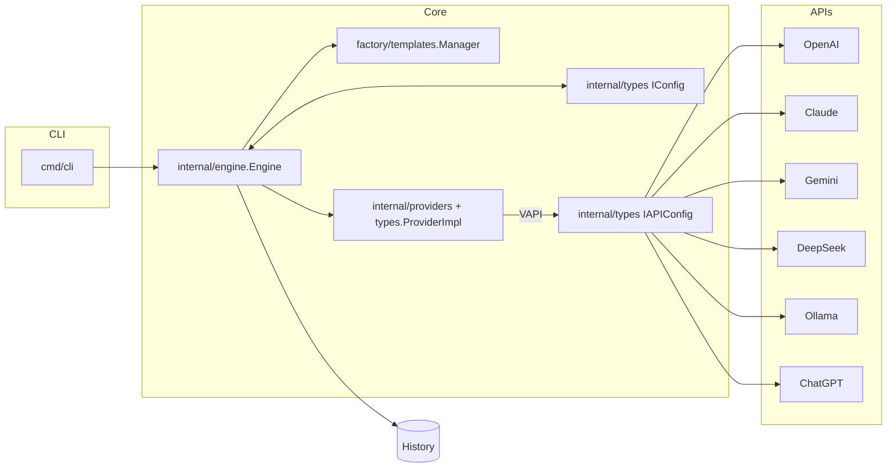

# Arquitetura

Visão geral da arquitetura técnica do Grompt.

## 🏗️ Visão Geral

O Grompt é construído como uma aplicação híbrida com:

- **Backend Go:** API REST robusta
- **Frontend React:** Interface moderna
- **Binário único:** Embedded frontend

## 📦 Componentes Principais

### Engine (Core)

**Localização:** `internal/engine/`

Responsável por:

- Engenharia de prompts
- Processamento de ideias
- Geração de contexto

### Providers

**Localização:** `internal/providers/`

Integrações com:

- OpenAI GPT
- Anthropic Claude
- Google Gemini
- DeepSeek
- Ollama

### Services

**Localização:** `internal/services/`

Serviços de negócio:

- Gerenciamento de sessões
- Validação de entrada
- Rate limiting

### Frontend

**Localização:** `frontend/`

Interface React com:

- Componentes reutilizáveis
- Estado global
- Hooks customizados

## 🔄 Fluxo de Dados

```plaintext
User Input → Validation → Engine → AI Provider → Response → UI
```

## 📈 Diagrama (Mermaid)



## 🚀 Deployment

- **Desenvolvimento:** `make dev`
- **Produção:** `make build`
- **Docker:** `docker build`

---

Documentação detalhada em desenvolvimento.
