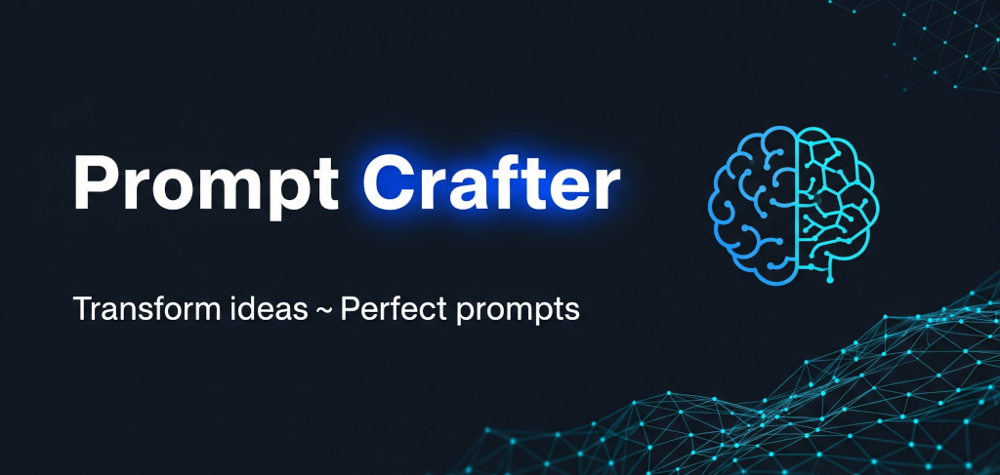

# Grompt - Engenharia de Prompts Profissional



[](https://golang.org)
[](https://reactjs.org)
[](https://github.com/kubex-ecosystem/gemx/grompt/blob/main/LICENSE)
[](development/contributing.md)
[](https://github.com/kubex-ecosystem/gemx/grompt/stargazers)

---

**Grompt** é uma ferramenta moderna de engenharia de prompts que aplica práticas reais de engenharia para transformar pensamentos bagunçados e desestruturados em prompts limpos e eficazes para modelos de IA. Construído com Go e React, roda como um binário único com zero dependências.

## 🎯 Por que o Grompt?

O Grompt revoluciona a forma como você interage com modelos de IA, transformando ideias vagas em prompts estruturados e eficazes.

### Antes do Grompt

```plaintext
oi, pode me ajudar a fazer uma função que pega uma lista e ordena mas também
remove duplicatas e talvez retorna a contagem também? ah e deveria funcionar
com strings e números...
```

### Depois do Grompt

```plaintext
Crie uma função TypeScript genérica que:

**Objetivo Principal:** Processar arrays com funcionalidade dupla - ordenação e deduplicação

**Requisitos:**
- Aceitar arrays de tipos primitivos (strings, números)
- Remover valores duplicados preservando os tipos de dados originais
- Ordenar resultados usando lógica de comparação apropriada
- Retornar tanto o array processado quanto metadados de contagem

**Saída Esperada:**
- Assinatura da função com restrições genéricas adequadas
- Tipo de retorno: { sorted: T[], count: number }
- Tratar casos extremos (arrays vazios, elementos únicos)
- Incluir documentação JSDoc com exemplos

**Contexto:** Construindo um utilitário de processamento de dados para uma
aplicação React onde manipulação consistente de arrays é necessária em
múltiplos componentes.
```

## ✨ Características Principais

| Funcionalidade | Descrição |
|---------|-------------|
| 🧠 **Engenharia de Prompts Real** | Aplica técnicas genuínas de engenharia de prompts, não apenas templates |
| ⚛️ **Interface React Moderna** | Interface responsiva e intuitiva com temas claro/escuro |
| 🐹 **Backend Go Robusto** | Servidor HTTP eficiente com zero dependências externas |
| 📦 **Binário Único** | Executável autocontido - apenas baixe e execute |
| 🌍 **Multiplataforma** | Suporte para Windows, Linux, macOS |
| 🔌 **Múltiplos Provedores de IA** | OpenAI, Claude, DeepSeek, Ollama, além de modo demo |
| 🚀 **Configuração Instantânea** | Sem instalação, configuração ou dependências de nuvem |

## 🚀 Início Rápido

### Opção 1: Download Direto

Baixe a versão mais recente para sua plataforma:

- [Linux amd64](https://github.com/kubex-ecosystem/gemx/grompt/releases/latest/download/grompt_linux_amd64)
- [macOS Intel](https://github.com/kubex-ecosystem/gemx/grompt/releases/latest/download/grompt_darwin_amd64)
- [macOS Apple Silicon](https://github.com/kubex-ecosystem/gemx/grompt/releases/latest/download/grompt_darwin_arm64)
- [Windows](https://github.com/kubex-ecosystem/gemx/grompt/releases/latest/download/grompt_windows_amd64.exe)

### Opção 2: Via Terminal

```bash
# Baixe a versão mais recente para sua plataforma
curl -L https://github.com/kubex-ecosystem/gemx/grompt/releases/latest/download/grompt-linux-amd64 -o grompt
chmod +x grompt
./grompt

# Abre automaticamente em http://localhost:8080
```

### Opção 3: Compilar do Código Fonte

```bash
git clone https://github.com/kubex-ecosystem/gemx/grompt
cd grompt
make build
./dist/grompt -h
```

**É isso!** Sem Docker, sem configuração complexa, sem contas na nuvem necessárias.

## 🎪 Casos de Uso

| Cenário | Como o Grompt Ajuda |
|----------|------------------|
| **Revisões de Código** | Transforma feedback vago em prompts específicos e acionáveis para melhorias |
| **Criação de Conteúdo** | Converte briefings de conteúdo em prompts detalhados para escrita criativa ou copywriting |
| **Aprendizado e Pesquisa** | Transforma tópicos de estudo em prompts de aprendizado estruturados com objetivos claros |
| **Documentação de API** | Converte notas técnicas em solicitações de documentação abrangentes |
| **Sistemas de Design** | Transforma ideias de design em prompts detalhados de especificação de componentes |
| **Análise de Dados** | Converte questões de negócio em prompts precisos de ciência de dados e análise |

## 📚 Próximos Passos

- **[Guia de Instalação](getting-started/installation.md)** - Instruções detalhadas de instalação e configuração
- **[Início Rápido](getting-started/quickstart.md)** - Comece a usar em 5 minutos
- **[Guia do Usuário](user-guide/cli-commands.md)** - Comandos CLI e exemplos de uso
- **[Configuração](user-guide/configuration.md)** - Configure provedores de IA e personalize o ambiente

## 🤝 Comunidade

- **[Contribuindo](development/contributing.md)** - Como contribuir para o projeto
- **[Código de Conduta](community/code-of-conduct.md)** - Nossas diretrizes de comunidade
- **[GitHub Issues](https://github.com/kubex-ecosystem/gemx/grompt/issues)** - Reporte bugs ou solicite recursos

---

*Transforme suas ideias em prompts poderosos hoje mesmo!*

[⭐ Dê uma estrela no projeto](https://github.com/kubex-ecosystem/gemx/grompt/stargazers) |
[🐛 Reportar Bug](https://github.com/kubex-ecosystem/gemx/grompt/issues) |
[✨ Solicitar Funcionalidade](https://github.com/kubex-ecosystem/gemx/grompt/issues)
